## 计算机毕业设计之Python+Vue.js+Flask+LSTM音乐爬虫可视化系统 音乐推荐系统 音 乐LSTM深度学习情感分析 协同过滤算法音乐推荐系统 大数据毕业设计

## 要求
### 源码有偿一套(论文 PPT 源码+sql脚本)
### 

### 加好友前帮忙start一下，并备注github有偿获取源码
### 我的QQ号是2877135669 或者 1679232425
### 加qq好友说明（被部分  网友整得心力交瘁）：
    1.加好友务必按照格式备注
    2.避免浪费各自的时间

## 开发技术
协同过滤算法、机器学习、LSTM、vue.js、echarts、Flask、Python、MySQL

## 创新点
协同过滤推荐算法、爬虫、数据可视化、LSTM情感分析、短信、身份证识别

## 补充说明
适合大数据毕业设计、数据分析、爬虫类计算机毕业设计

## 介绍

- 音乐数据的爬取：爬取歌曲、歌手、歌词、评论
- 音乐数据的可视化：数据大屏+多种分析图【十几个图】
- 深度学习之LSTM 音乐评论情感分析
- 交互式协同过滤音乐推荐： 2种协同过滤算法、通过点击歌曲喜欢来修改用户对歌曲的评分
- 歌词、乐评的词云
- 登录、注册、修改个人信息等【集成身份证识别、短信验证码等】

# 运行截图

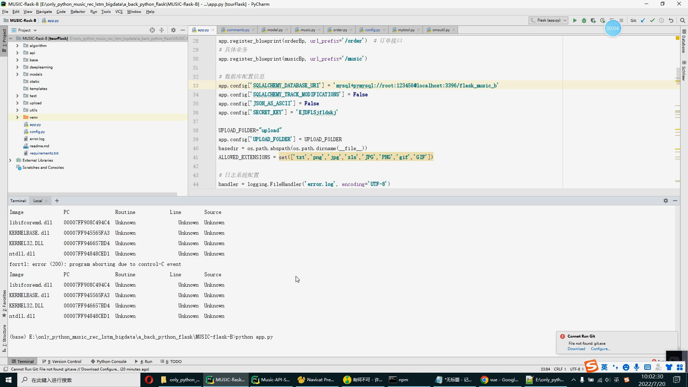

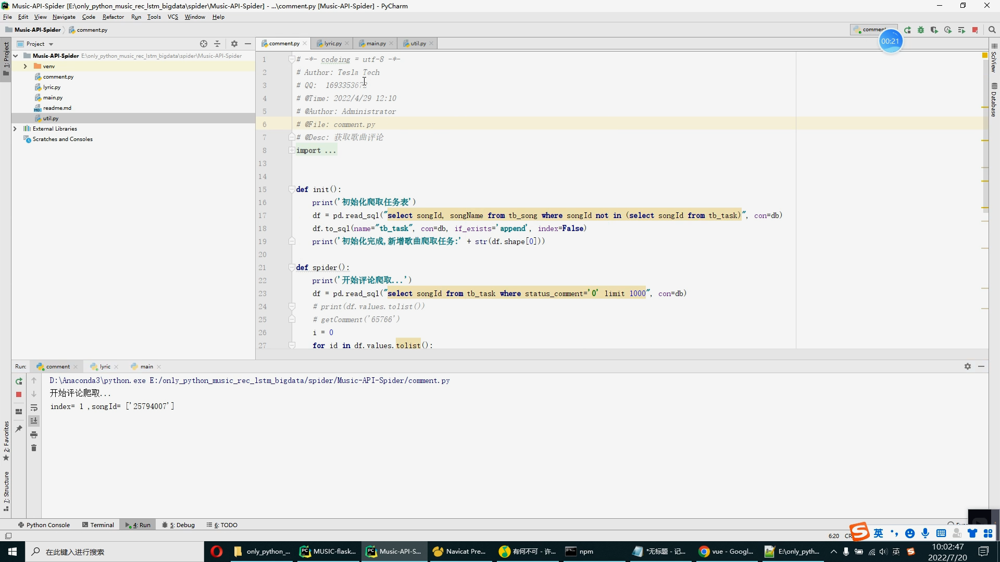

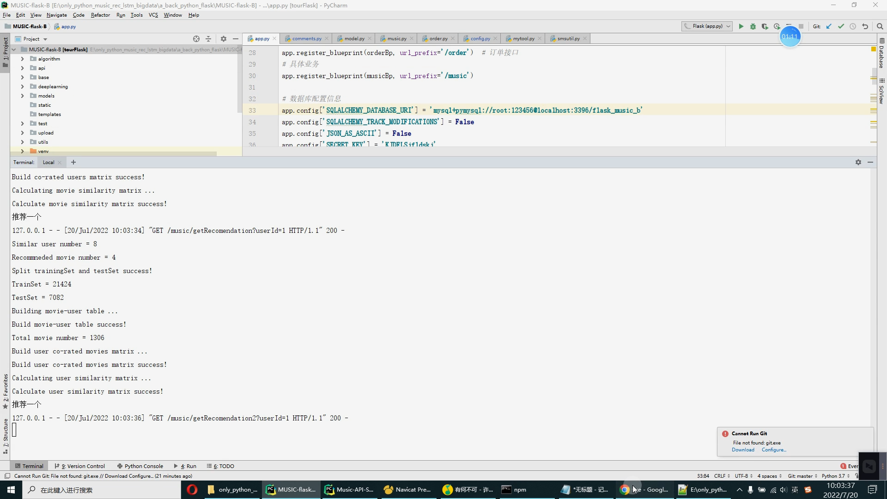

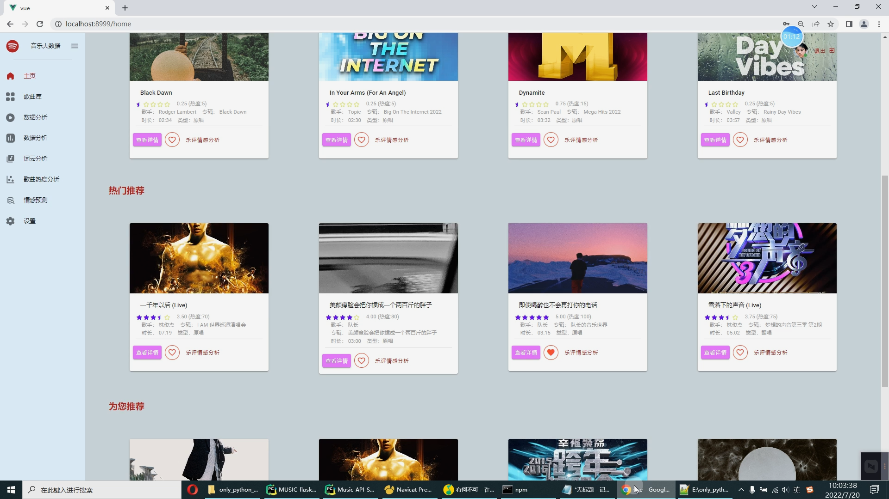

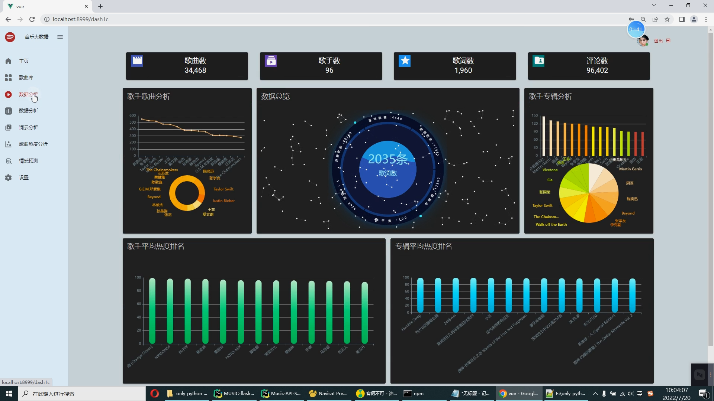

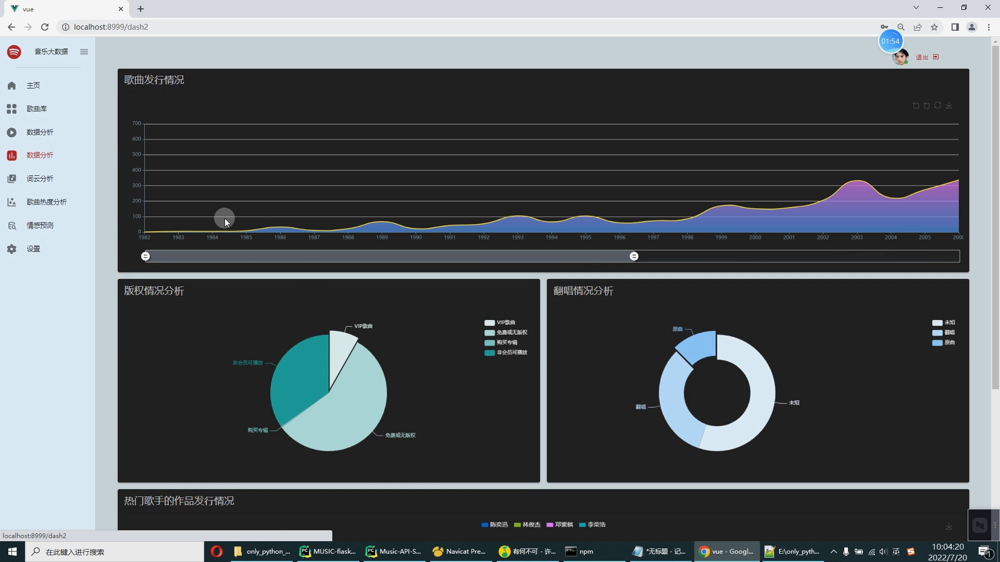

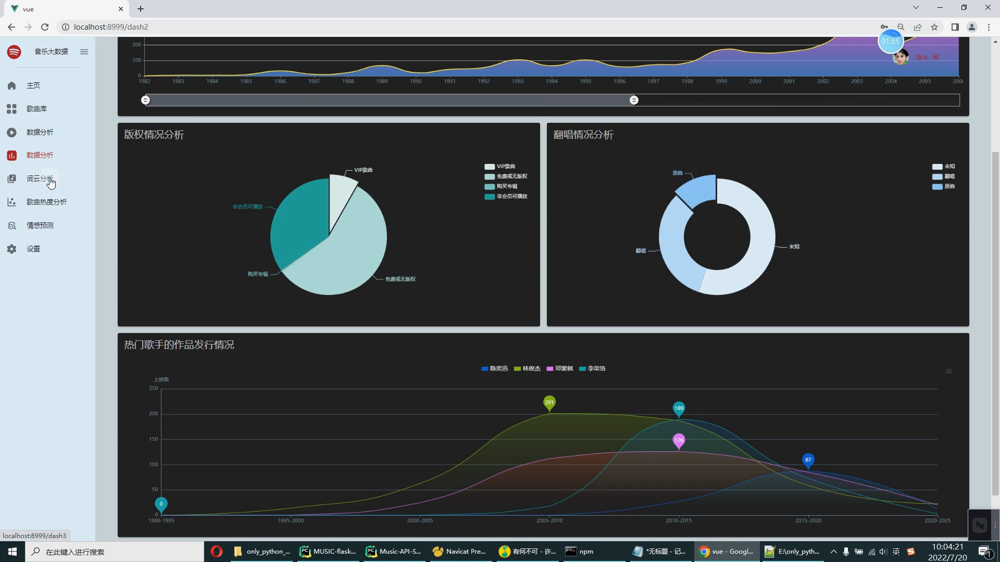

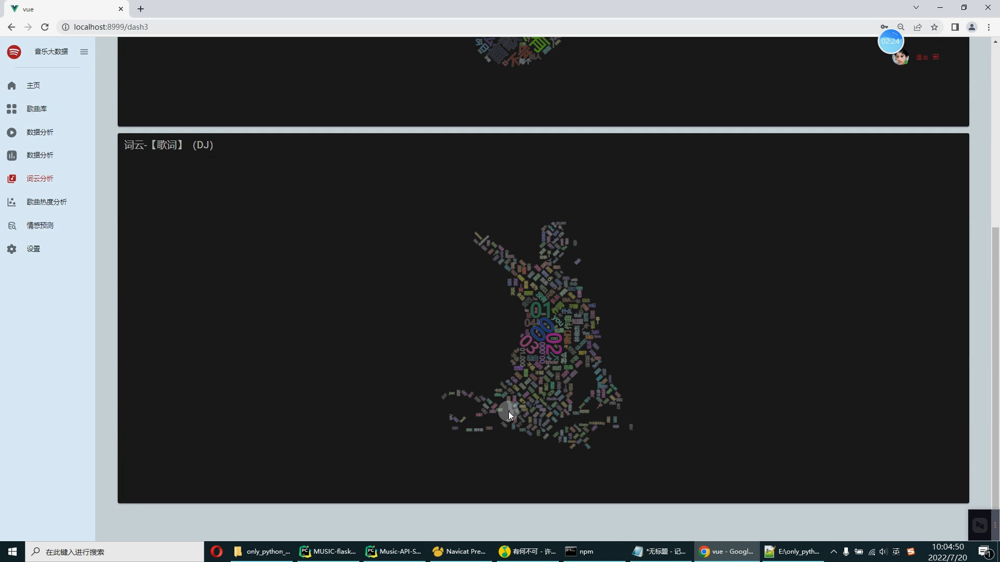

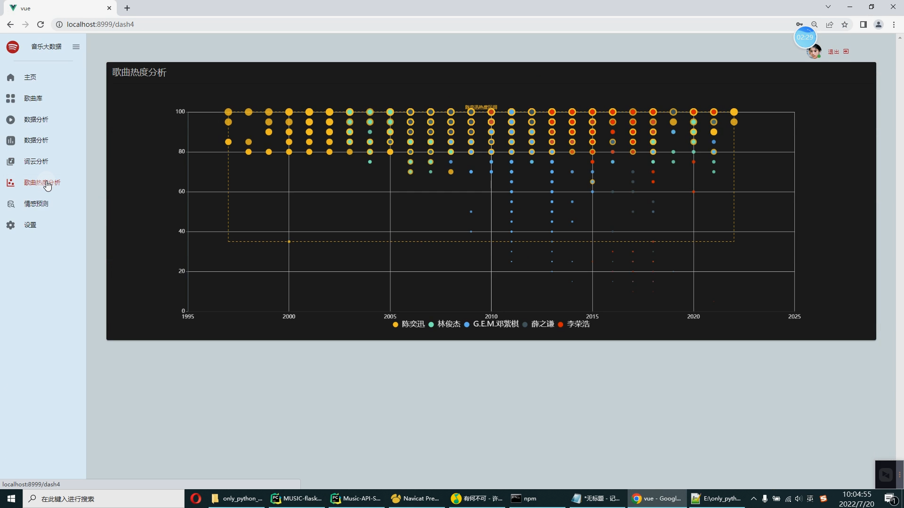

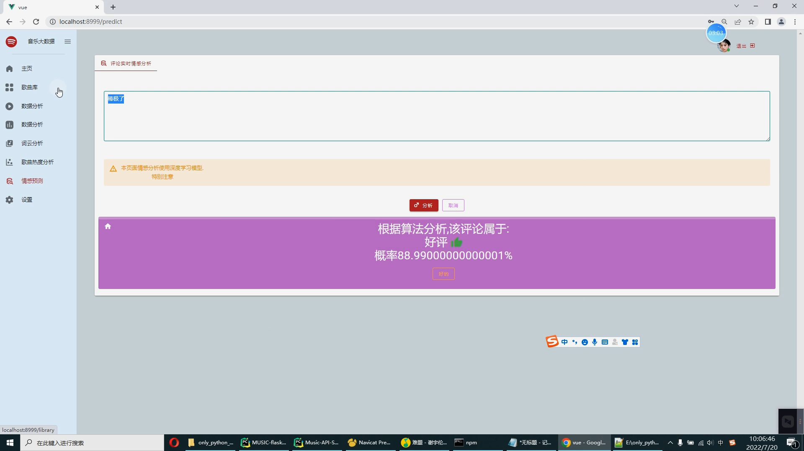

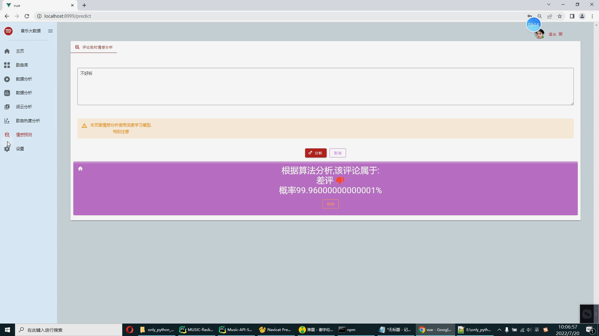

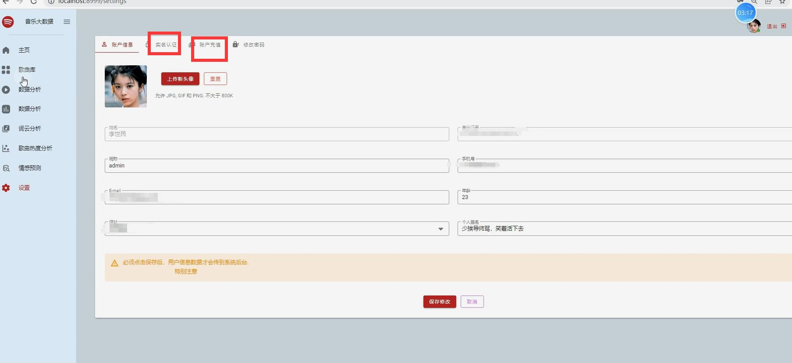

